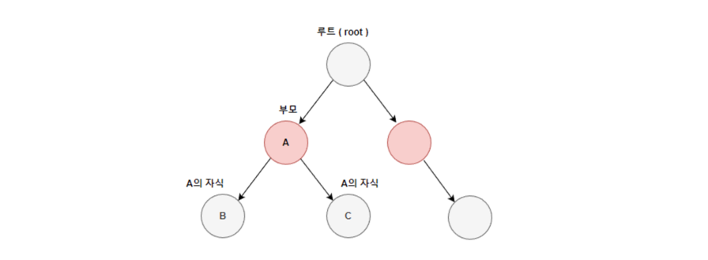

#Tree Set

트리셋은 밸런스드 이진트리로 구현되어 있다.

정렬, 검색, 범위검색(range search)에 높은 성능을 보인다.

다만 해시셋에 비해 데이터 추가, 삭제에 시간이 더 걸린다.

해시맵처럼 조회에 O(1)의 시간복잡도를 가지지 않는다.

이는 이진트리를 직접 확인하기 때문이다 !

대신 범위를 찾을때는 훨신 효율적으로 작용한다 ! 



```
TreeSet<타입> tree = new TreeSet<>(); // TreeSet 생성 ( 기본 : 오름차순 )
TreeSet<타입> tree = new TreeSet<>(Collection c); // 주어진 컬렉션을 저장하는 TreeSet 생성 ( 기본 : 오름차순 )
TreeSet<타입> tree = new TreeSet<>(Collections.reverseOrder()); // 내림차순 정렬로 TreeSet 생성
```